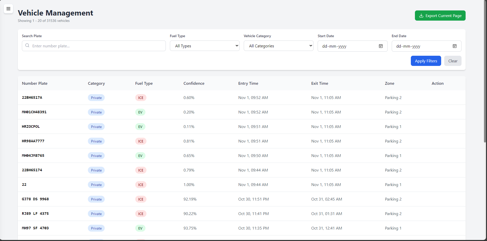

# Traffic Optimization & Parking Management System

This is a full-stack application for real-time traffic monitoring and management using Automatic Number Plate Recognition (ANPR). The system identifies vehicles from a live video feed, classifies them by category and fuel type, and provides a rich web interface for monitoring traffic flow, parking occupancy, and environmental impact metrics.

The project consists of three core services:

1.  **ANPR Detection Service**: A Python script using a YOLO object detection model and EasyOCR to read license plates.
2.  **Backend Service**: A Node.js server built with Express and Socket.IO to process data, manage the database, and provide real-time updates.
3.  **Frontend Application**: A responsive React single-page application for data visualization and system management.

## Features

  * **Real-Time ANPR**: Detects and recognizes vehicle license plates from a live webcam feed using a custom-trained YOLO model.
  * **Intelligent Debouncing**: A custom `VehicleTracker` class collects multiple readings over a time window and confirms a plate only after several consistent detections, preventing spam and inaccurate entries.
  * **Live Dashboard**: Displays a real-time feed of incoming vehicles, a dynamic overview of parking zone occupancy, and a pollution meter based on the ratio of ICE to EV vehicles.
  * **Parking Zone Management**: A full CRUD interface to create, read, update, and delete parking zones, including setting total capacity and occupancy thresholds.
  * **Vehicle Log Management**: View, search, and filter a complete history of all logged vehicles. Manually record a vehicle's exit time to free up parking slots.
  * **Data Analytics & Reporting**: View historical data trends for daily traffic volume and pollution scores. Export comprehensive vehicle logs to CSV or PDF formats.
  * **Real-Time Updates**: Leverages WebSockets to ensure the UI reflects changes instantly without needing to refresh the page.

## Application Preview

Here is a glimpse of the main application interfaces.

| Main Dashboard | Vehicle Logs Management |
| :---: | :---: |
|  |  |

| Parking Zone Management | Logs & Reports |
| :---: | :---: |
|  |  |

## Tech Stack

  * **ANPR Service**:
      * Python
      * OpenCV
      * Ultralytics YOLOv8
      * EasyOCR
  * **Backend**:
      * Node.js
      * Express.js
      * MySQL2
      * Socket.IO
  * **Frontend**:
      * React
      * Tailwind CSS
      * Recharts (for data visualization)
      * Axios & Socket.io-client

## Getting Started

Follow these instructions to set up and run the entire project on your local machine.

### Prerequisites

  * Node.js (v14 or later)
  * Python (v3.8 or later) with `pip`
  * MySQL Server (v8.0 or later)
  * A webcam for the ANPR service

### 1\. Database Setup

First, you need to create the database, tables, and a dedicated user.

1.  **Start your MySQL server.**
2.  **Run the Schema File**: From your system terminal (not the MySQL prompt), navigate to the `backend/config/` directory and execute the schema file. This will create the database and tables.
    ```bash
    # Log in as a user with database creation privileges (e.g., root)
    mysql -u root -p < schema.sql
    ```

### 2\. Backend Setup

1.  Navigate to the `backend` directory:
    ```bash
    cd backend
    ```
2.  Install the Node.js dependencies:
    ```bash
    npm install
    ```
3.  Create a `.env` file in the `backend` directory. Copy the content from the **Backend Environment Variables** section below and fill it with your database credentials.
4.  Start the backend server in development mode (with auto-reloading):
    ```bash
    npm run dev
    ```
    The server will start on `http://localhost:5000`. You should see a "MySQL Connected Successfully" message.

### 3\. Frontend Setup

1.  Open a **new terminal** and navigate to the `frontend` directory:
    ```bash
    cd frontend
    ```
2.  Install the Node.js dependencies:
    ```bash
    npm install
    ```
3.  Create a `.env` file in the `frontend` directory. Copy the content from the **Frontend Environment Variables** section below.
4.  Start the React development server:
    ```bash
    npm start
    ```
    The application will open in your browser at `http://localhost:3000`.

### 4\. ANPR Service Setup

1.  Open a **new terminal** and navigate to the `anpr` directory:
    ```bash
    cd anpr
    ```
2.  Install the required Python packages. It's recommended to do this in a virtual environment.
    ```bash
    # You may need to create a requirements.txt file with these contents:
    # opencv-python
    # ultralytics
    # requests
    # easyocr
    # numpy
    pip install -r requirements.txt
    ```
3.  Run the detection script:
    ```bash
    python detect.py
    ```
    This will initialize your webcam. As vehicles are detected and confirmed, you will see log messages in the terminal and data will appear in the web application in real-time.

-----

## Environment Variables

You must create a `.env` file in both the `backend` and `frontend` directories.

#### **Backend (`backend/.env`)**

This file configures the database connection and server port.

```env
# Database Configuration
DB_HOST=localhost
DB_USER=user1
DB_PASSWORD=StrongPassword123
DB_NAME=traffic_optimization

# Server Configuration
PORT=5000
NODE_ENV=development
```

#### **Frontend (`frontend/.env`)**

This file tells the React application where to find the backend API and WebSocket server.

```env
REACT_APP_API_URL=http://localhost:5000/api
REACT_APP_SOCKET_URL=http://localhost:5000
```

## License

This project is licensed under the MIT License. See the [LICENSE](https://www.google.com/search?q=LICENSE) file for details.